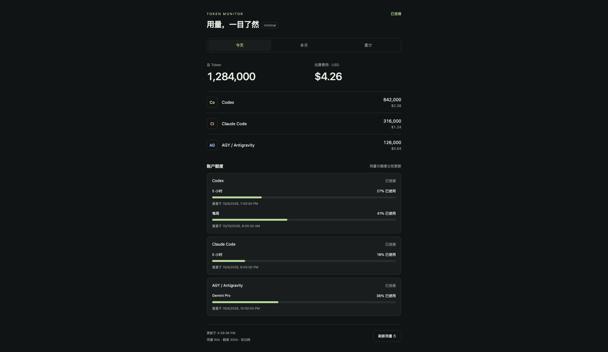
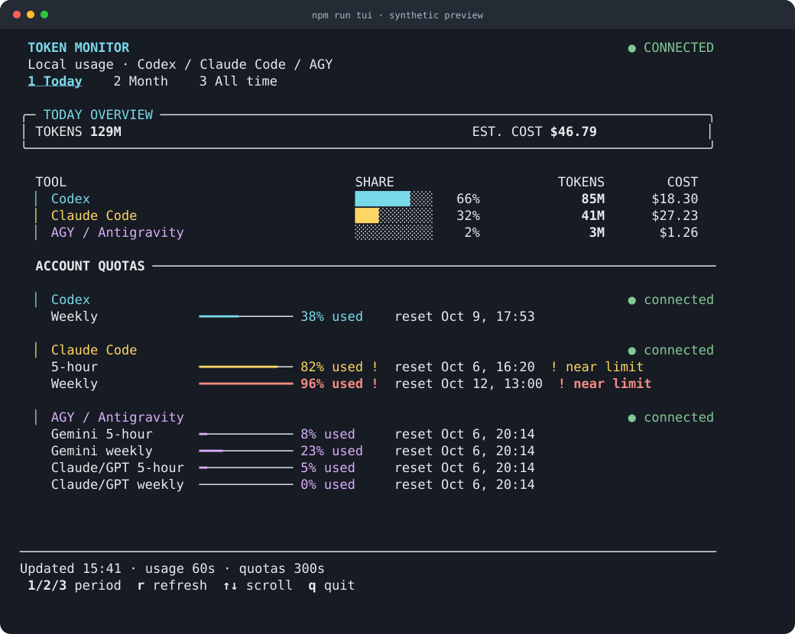

# Token Monitor minimal

This branch makes minimal the default desktop and headless runtime. It supports only **Codex, Claude Code (`claude`), and AGY / Antigravity (`antigravity`)**, including Antigravity's native, CLI and extension token sources through the existing scanner. Other clients are rejected by the minimal configuration boundary.



## Run locally

Requires Node >=22.15.0; Node 24 LTS is suitable. Install desktop dependencies with `npm ci`. Optional environment defaults are in `.env.minimal.example` (copy it to `.env`); use this template rather than the full runtime’s `.env.example`. Then:

```sh
npm start
```

The desktop supports macOS and lives in the top menu bar. Click its icon to open a sandboxed usage panel; click outside it or press Escape to close it. The renderer is destroyed when dismissed, so idle monitoring retains no hidden Chromium page. The collector and local HTTP service keep running at their low-frequency intervals until you choose Quit in the icon’s right-click menu. That menu also offers optional login startup. There is no Dock icon, Edge Dock, Discord integration, updater or widget extension. Its randomly generated local API secret stays in Electron main.

Headless mode is a **background collector service plus a separate terminal UI**:

```sh
npm run service:start
npm run tui
npm run service:status
# Stop collection when finished:
npm run service:stop
```



`service:start` detaches the Node collector from its launching terminal and waits until its API is listening. Repeated starts reuse the managed instance. The TUI reads aggregate snapshots over HTTP and never imports the collector or starts provider scans. Close it with `q`, Escape or Ctrl+C; the background service continues collecting. Neither component needs Electron, a display, X11, Wayland or a browser. These commands do not enable automatic login startup.

The TUI uses integer K/M/B token counts, a compact overview card, colored provider rows with usage-share bars, quota meters and reset times. Active tabs are underlined; quota usage at 80% turns yellow and at 95% turns red, with a text warning marker that also works without color. Provider failures and cached quota readings remain explicit. `1`/`2`/`3`, left/right or Tab switch today/month/all-time locally. `r` requests usage only; quota refresh keeps its independent timer. Up/down and PageUp/PageDown scroll when the terminal is short. It polls snapshots every five seconds and redraws only changed frames, without animation; network errors keep the last reading visibly offline and retry. Styling uses the terminal's ANSI palette, without changing its background. `NO_COLOR` disables colors; non-UTF-8 locales and `TOKEN_MONITOR_TUI_ASCII=1` use ASCII decorations. `--once` always emits uncolored ASCII decorations. Wide labels and emoji count by terminal cells, and upstream escape sequences are stripped before styling. Exit restores raw mode, cursor and the previous screen.

For a plain text snapshot (also works when stdout is redirected):

```sh
npm run tui -- --once
npm run tui -- --once --period allTime
```

The fixed text dashboard uses Node's readline/TTY interfaces rather than introducing Ink/React or a widget framework: it needs only a table, quota rows, scrolling and a few keys. Node's detached-child/IPC bootstrap is used for manual local start/stop; PID metadata includes a random instance marker checked against the process command before signaling, protecting against PID reuse. State and logs live in the private `minimal-service` subdirectory of the existing shared data directory; bearer secrets are not written there or put in the daemon's command line. For persistent Linux deployment, the existing systemd user service below provides OS-managed restart and login/logout behavior.

`npm run headless` remains available to run the API collector in the foreground, stopped with Ctrl+C. Browser assets are now disabled by default. The previous browser interface is an explicit compatibility option:

```sh
npm run headless -- --web 1
# Optional browser: http://127.0.0.1:17322
```

The macOS menu app explicitly enables its web panel, so this headless default does not change desktop behavior.

```sh
npm run headless:once -- --dry-run --limits 0
npm run headless -- --clients codex,claude --interval 120000
npm run headless -- --watch 1
npm run headless -- --help
```

A one-shot prints the existing device wire record as JSON, waits for selected quota probes, and exits. `--dry-run` also collects once, skips Hub delivery, and skips managed Antigravity credential persistence. Disabling quotas with `--limits 0` avoids quota requests and login probes.

## Install the macOS menu bar app

Build the standalone app with the existing Electron/electron-builder toolchain:

```sh
npm run pack:mac:minimal
```

The output is under `dist/minimal-mac/mac-<arch>/Token Monitor Minimal.app`. Copy it to `~/Applications` and open it; terminal commands and a system Node installation are unnecessary after packaging. This local build is ad-hoc signed with a separate bundle identity (`local.tokenmonitor.minimal`), and is intended for local installation. It preserves other Token Monitor installations. Public distribution would require the usual Developer ID signing/notarization. The minimal macOS build excludes the full desktop UI and widget extension.

## What reduces resource use

- Only selected Codex, Claude and Antigravity quota adapters are loaded; the full limits registry is not imported.
- Usage scans request `client,model` grouping directly from tokscale. Historical session rows, transcript metadata indexes, titles, context and project enrichment are unnecessary for this dashboard and are omitted.
- History graphs, daily/session archives, anchor disk persistence and WSL discovery are disabled. Token totals, cache token accounting and pricing still use the shared scanner and normalization contracts.
- Default usage collection is every 60 seconds with no recursive watcher process. After the initial three serial today/month/all-time scans, the shared collector scans today and applies the existing exact delta. It reconciles full periods hourly and across day/pricing changes. No approximate totals are introduced.
- Quota probes run serially and have their own five-minute timer, scheduled after completion. Local token events never refresh quotas. Network requests share a per-provider abort signal and deadline; transient quota failures retain the previous reading visibly as stale.
- `--watch 1` opts into the existing native event watcher and 3–5 second debounce behavior. It increases resource use and retains the bounded polling fallback on descriptor exhaustion. No additional watch cooldown is added.

This deliberately trades default real-time latency for lower background work. Usage may be one interval old. The TUI `r` key and optional browser refresh control request usage only, with a short request limit to prevent repeated expensive scans. Source data still must be present on the machine running the collector.

## Server installation

Run under the same user as the coding CLIs; quotas use their existing local credentials. Installing production dependencies skips Electron and development tooling:

```sh
npm ci --omit=dev
npm run service:start
npm run tui
```

Only app/agent entry points run the pinned scanner installer. Installation, Hub, tests and lint keep their existing behavior. Standard HTTP(S)_PROXY, ALL_PROXY and NO_PROXY environment settings apply to quota and Hub requests.

The default server listens only on loopback. SSH forwarding works without publishing a port:

```sh
ssh -L 17324:127.0.0.1:17322 your-server
npm run tui -- --server http://127.0.0.1:17324
```

For a network listener, configure an API secret; startup refuses a non-loopback address without one. Use HTTPS termination for network access. Set `TOKEN_MONITOR_SECRET` in the TUI environment to send bearer authentication; it is never added to the URL or rendered. TUI requests refuse redirects. When explicitly enabled, the optional browser prompts for the same secret and keeps it only in tab memory.

```sh
TOKEN_MONITOR_MINIMAL_HOST=0.0.0.0 TOKEN_MONITOR_SECRET='your-secret' npm run service:start
TOKEN_MONITOR_SECRET='your-secret' npm run tui -- --server https://monitor.example
```

The read-only API is `GET /api/stats` and `GET /api/health`; `POST /api/refresh` requests usage collection. All API endpoints require bearer authentication when a secret is configured. TUI/browser DTOs expose totals and quota windows (including the normalized window kind for fallback labels), without account emails, identifiers, source paths, credentials or transcripts. No ingest or account-management API is exposed by the minimal service. An optional existing Hub remains a separate service:

```sh
TOKEN_MONITOR_HUB_URL=https://your-hub.example TOKEN_MONITOR_SECRET='hub-secret' npm run headless
```

Hub uploads use the existing device wire schema and latest-only ordered queue, so a slow Hub cannot accumulate historical records in memory. Local dashboard and Hub authentication use the same configured secret. Session titles are absent from aggregate-only records.

To run continuously on Linux, copy [the user service](../deploy/token-monitor-minimal.service) into `~/.config/systemd/user/`. It assumes checkout at `~/token-monitor` and Node at `/usr/bin/node`; adjust those paths to match your installation. Run `npm run ensure:tokscale` once before enabling the service, since its direct Node entry does not download a binary. Put optional settings in `~/.config/token-monitor-minimal.env` with mode 600.

```sh
mkdir -p ~/.config/systemd/user
cp deploy/token-monitor-minimal.service ~/.config/systemd/user/
systemctl --user daemon-reload
systemctl --user enable --now token-monitor-minimal
journalctl --user -u token-monitor-minimal -f
```

Enable user lingering if the service must survive logout (`loginctl enable-linger "$USER"`). SIGTERM stops scheduled work, aborts probes and scans, closes connections, and waits for scanner termination.

## AGY quota on a server

AGY token usage comes from local conversation data. Its local quota RPC requires the running AGY language server; installing the Node monitor on a server does not create that source. For quotas without a running AGY app, provide already authorized managed OAuth accounts in a private JSON file:

```json
{
  "antigravityManagedAccounts": [{
    "id": "server-agy",
    "accountEmail": "you@example.com",
    "enabled": true,
    "credentials": {
      "accessToken": "your-authorized-access-token",
      "refreshToken": "your-authorized-refresh-token",
      "expiresAt": 1800000000000,
      "clientId": "the-client-id-used-for-authorization",
      "clientSecret": "the-client-secret-used-for-authorization",
      "projectId": "your-associated-project-id"
    }
  }]
}
```

```sh
chmod 600 /private/accounts.json
npm run headless -- --accountsFile /private/accounts.json
```

The shape matches the existing provider's managed-account contract. Include the complete credential object from the original authorized login, including its OAuth client identity; refresh tokens alone are insufficient. Refreshed AGY credentials are atomically persisted with private permissions. The file can also hold `codexManagedAccounts`, `claudeWebCookie` and `claudeWebOrganizationId` using the existing provider shapes. The minimal TUI and optional browser do not implement account login or switching; use the CLIs or full app for authorization. OAuth credentials measure quota, and do not supply token history.

## Migration and verification

`npm start`, `npm run widget`, and `npm run dev` now open minimal. `npm run agent` / `agent:once` now run minimal headless. For an existing full configuration or flags such as project/history archives, use `npm run start:full` or `npm run agent:full -- --once`. The full implementation and provider catalogs remain in the repository for compatibility and shared tests; they are not the minimal runtime's user interface. Existing settings and archives are not migrated or overwritten. Update an existing full `.env` client list to `codex,claude,antigravity` before using minimal; unsupported client IDs cause an explicit startup error.

Automated validation is `npm run verify`. Background-service tests exercise authenticated bootstrap, duplicate start, failed binds, cancelled startup, stale PID metadata and graceful stop; TUI tests exercise period changes without rescanning, refresh isolation, scrolling, terminal-injection filtering, reconnect behavior and raw-mode/cursor restoration. `tests/minimal/` covers timer/input validation, aggregate scan grouping, exact totals, skipped metadata reads, serial quota lifecycle, shutdown cancellation, API authentication, privacy projection and refresh behavior. The shared collector tests cover exact deltas, rollover and subprocess termination.

Run the synthetic benchmark (no private logs, quota requests or pricing network):

```sh
npm run ensure:tokscale
npm run benchmark:minimal -- 3000
```

It generates isolated Codex transcripts, runs three serial scans for each mode in separate Node processes and checks token/cost parity. It reports Node peak RSS, Node CPU time, end-to-end elapsed time, retained session count and snapshot size. It **excludes Electron and the scanner subprocess from CPU/RSS**, and disables quotas/history/watching in both modes; it isolates aggregate-vs-session collection rather than measuring battery life or comparing the entire full product. Pricing is intentionally an empty offline cache, so cost parity here is zero; provider/pricing correctness remains covered by the repository tests.

A development measurement on macOS arm64 / Node 25.9.0 with 3,000 synthetic sessions returned 3,300,000 tokens in both modes. Node peak RSS was 143 MiB for session collection and 65 MiB for minimal; Node CPU was 2,685 ms and 87 ms; snapshot sizes were 5,762,847 and 2,850 bytes. Measurements vary with platform, source volume, cache warmth and scanner version. Re-run the command on the target server before setting memory budgets.

On macOS, AGY quotas reuse the Antigravity CLI's consumer login from its native Keychain item. Run `agy` once and wait for automatic sign-in; the menu app can then read quota over OAuth with the CLI closed. Expired access tokens are refreshed in memory. Explicit `--accountsFile` AGY accounts take precedence; other platforms continue to use local RPC or the private managed-account file. The menu app does not automatically start a CLI. Provider SVG sources are recorded in `src/minimal/web/icons/README.md`.
